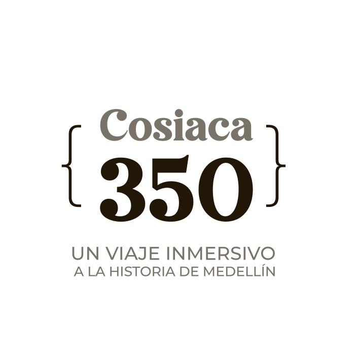

# COSIACA 350 - Un Viaje Inmersivo a la Historia de Medellín



## Descripción del Proyecto

**COSIACA 350** es una propuesta transmedia interactiva que celebra los 350 años de Medellín a través de la figura histórica de José García, alias "Cosiaca", un personaje popular, pícaro y humorístico del siglo XIX. Este proyecto combina historia, tecnología y humor paisa para crear una experiencia educativa e inmersiva.

El proyecto integra múltiples componentes digitales:

- 🌐 **Micrositio Web Interactivo**: Portal central con mapa histórico, línea de tiempo y acceso a todos los contenidos
- 🤖 **CosiacaBot**: Chatbot conversacional con personalidad pícara y conocimiento histórico
- 🎧 **Pódcast Histórico**: Episodios narrativos con humor costumbrista
- 🎮 **Juegos Educativos**: Trivia y desafíos históricos interactivos
- 📚 **Contenido Digital**: Acceso a libro digital, videos y archivo histórico
- 🎨 **Interfaz Accesible**: Diseño responsivo con controles de accesibilidad

---

## Características Principales

### 🎨 Diseño y Estética

- **Paleta de colores**: Tonos café (#6B4226), beige (#F5E9D4), rojo (#C92C3D) y blanco/negro
- **Tipografía**: Montserrat para legibilidad óptima
- **Estilo**: Cálido, editorial, limpio e inmersivo
- **Responsive**: Adaptado a dispositivos móviles, tablets y desktop

### 🌍 Navegación Interactiva

- Mapa histórico interactivo de Antioquia
- Línea de tiempo de eventos desde 1675 hasta 2025
- Navegación fluida con animaciones suaves
- Botones de scroll orgánico para mejor experiencia

### 🤖 Inteligencia Artificial

- **CosiacaBot**: Chatbot con personalidad basada en el personaje histórico
- Respuestas de doble capa: humor pícaro + dato histórico
- Integración con múltiples proveedores de IA (OpenAI, Gemini, Claude)
- Modo conversacional y modo trivia

### ♿ Accesibilidad

- Controles de accesibilidad integrados
- Compatible con lectores de pantalla
- Navegación por teclado completa
- Contraste optimizado para discapacidad visual
- Tamaños de fuente ajustables

---

## Tecnologías Utilizadas

### Frontend
- **React 19.1.1**: Framework principal
- **Vite 5.4.2**: Build tool y dev server
- **Tailwind CSS**: Estilos y diseño responsivo
- **Firebase 12.3.0**: Backend y autenticación

### Integraciones
- **OpenAI API**: GPT-4o para conversaciones
- **Google Gemini**: Modelo Gemini 2.5 Flash
- **Anthropic Claude**: Claude Sonnet 3.5
- **PayPal**: Sistema de donaciones

### Herramientas de Desarrollo
- **ESLint**: Linting y calidad de código
- **Vite**: Hot Module Replacement (HMR)
- **Node.js**: Entorno de desarrollo

---

## Estructura del Proyecto

```
cosiaca350/
├── public/                      # Archivos estáticos
│   ├── AUDIOS_historias/       # Audios del pódcast
│   ├── logo-cosiaca.svg        # Logo principal
│   └── image.png               # Recursos visuales
├── src/
│   ├── components/             # Componentes React
│   │   ├── Home.jsx           # Página principal
│   │   ├── CosiacaBot.jsx     # Chatbot interactivo
│   │   ├── Podcast.jsx        # Reproductor de pódcast
│   │   ├── Juegos.jsx         # Juegos educativos
│   │   ├── Timeline.jsx       # Línea de tiempo histórica
│   │   ├── Archivo.jsx        # Archivo histórico
│   │   ├── Libros.jsx         # Contenido de libros
│   │   ├── Videos.jsx         # Galería de videos
│   │   └── ...                # Otros componentes
│   ├── data/                   # Datos y contenido
│   │   ├── historicalData.js  # Datos históricos 1675-1999
│   │   ├── modernHistory.js   # Historia moderna 2000-2025
│   │   ├── cosiacaPersonality.js # Personalidad del chatbot
│   │   ├── historicalGossip.js   # Anécdotas históricas
│   │   ├── paisaTrovas.js        # Trovas paisas
│   │   └── triviaQuestions.js    # Preguntas de trivia
│   ├── services/              # Servicios externos
│   │   ├── aiService.js       # Integración con OpenAI
│   │   └── geminiService.js   # Integración con Gemini
│   ├── icons/                 # Componentes de iconos
│   ├── App.jsx               # Componente principal
│   ├── App.css               # Estilos globales
│   └── main.jsx              # Punto de entrada
├── documents/                 # Documentación y recursos
├── PODCAST/                   # Archivos de audio originales
├── imagenes/                  # Recursos visuales adicionales
├── .env                       # Variables de entorno
├── package.json              # Dependencias del proyecto
├── vite.config.js           # Configuración de Vite
├── tailwind.config.js       # Configuración de Tailwind
└── README.md                # Este archivo
```

---

## Instalación y Configuración

### Prerrequisitos

- Node.js (versión 18 o superior)
- npm o yarn
- Claves API para servicios de IA (opcional)

### Pasos de Instalación

1. **Clonar el repositorio**
```bash
git clone [URL_DEL_REPOSITORIO]
cd cosiaca350
```

2. **Instalar dependencias**
```bash
npm install
```

3. **Configurar variables de entorno**

Crear un archivo `.env` en la raíz del proyecto con las siguientes variables:

```env
# Firebase Configuration
VITE_FIREBASE_API_KEY=tu_api_key
VITE_FIREBASE_AUTH_DOMAIN=tu_auth_domain
VITE_FIREBASE_PROJECT_ID=tu_project_id
VITE_FIREBASE_STORAGE_BUCKET=tu_storage_bucket
VITE_FIREBASE_MESSAGING_SENDER_ID=tu_sender_id
VITE_FIREBASE_APP_ID=tu_app_id

# AI Services (Opcional)
VITE_OPENAI_API_KEY=tu_openai_key
VITE_GEMINI_API_KEY=tu_gemini_key
VITE_ANTHROPIC_API_KEY=tu_anthropic_key

# PayPal (Opcional)
VITE_PAYPAL_CLIENT_ID=tu_paypal_client_id
```

4. **Iniciar servidor de desarrollo**
```bash
npm run dev
```

El proyecto estará disponible en `http://localhost:5173`

5. **Construir para producción**
```bash
npm run build
```

Los archivos optimizados se generarán en la carpeta `dist/`

---

## Scripts Disponibles

- `npm run dev`: Inicia el servidor de desarrollo
- `npm run build`: Construye la aplicación para producción
- `npm run preview`: Previsualiza la versión de producción
- `npm run lint`: Ejecuta el linter de código

---

## Componentes Principales

### 🏠 Home
Página principal con introducción al proyecto y navegación a todas las secciones.

### 🤖 CosiacaBot
Chatbot conversacional que responde preguntas sobre la historia de Medellín con el humor característico de Cosiaca. Soporta múltiples proveedores de IA.

### 🎧 Podcast
Reproductor de episodios históricos narrados con humor paisa. Incluye:
- Lista de episodios
- Reproductor de audio integrado
- Descripciones detalladas

### 🎮 Juegos
Trivia interactiva con preguntas sobre la historia de Medellín:
- Múltiples niveles de dificultad
- Sistema de puntuación
- Retroalimentación educativa

### 📜 Timeline
Línea de tiempo visual de eventos históricos desde 1675 hasta 2025, con filtros por categoría.

### 📚 Archivo
Galería de documentos históricos y recursos educativos.

### 🎥 Videos
Colección de videos narrativos producidos con IA sobre eventos históricos.

---

## Personalización del Chatbot

El chatbot "CosiacaBot" utiliza una personalidad definida en `src/data/cosiacaPersonality.js` que incluye:

- Tono humorístico y pícaro
- Conocimiento histórico profundo
- Expresiones paisas auténticas
- Respuestas de doble capa (humor + educación)

Para personalizar el chatbot, edita el archivo de personalidad y los datos históricos correspondientes.

---

## Sistema de Pagos

Este proyecto incluye integración de pagos adaptada para Colombia:

### Métodos de Pago Disponibles:

1. **PayPal** (Recomendado)
   - Acepta tarjetas de crédito y débito colombianas
   - Procesamiento seguro internacional
   - Configuración: Agregar tu `VITE_PAYPAL_CLIENT_ID` en las variables de entorno

2. **MercadoPago**
   - Para usuarios con cuentas de MercadoPago
   - Requiere configuración con tu cuenta de MercadoPago

3. **PSE** (Próximamente)
   - Integración con ePayco o Wompi
   - Pago directo desde cuentas bancarias colombianas

4. **Transferencia Bancaria**
   - Contacto directo para datos bancarios
   - Confirmación manual de pagos

---

## Contribución

Este proyecto es parte de las **Convocatorias de Fomento y Estímulos para el Arte y la Cultura 2025** de la Secretaría de Cultura Ciudadana de Medellín.

### Equipo

Desarrollado por **Núcleo Colectivo** - Colectivo de arte y tecnología de Medellín.

### Cómo Contribuir

1. Fork del proyecto
2. Crear una rama para tu funcionalidad (`git checkout -b feature/nueva-funcionalidad`)
3. Commit de tus cambios (`git commit -m 'Agregar nueva funcionalidad'`)
4. Push a la rama (`git push origin feature/nueva-funcionalidad`)
5. Abrir un Pull Request

---

## Redes Sociales y Contacto

### 🔗 Síguenos en:

- **TikTok**: [@ncleo.colectivo](https://www.tiktok.com/@ncleo.colectivo?_t=ZS-8zo20sFpiBY&_r=1)
- **Instagram**: [@cosiaca350](https://www.instagram.com/cosiaca350?igsh=MTNtZjB3a3V4dXRwOQ==)
- **Facebook**: [Núcleo Colectivo Faro](https://www.facebook.com/NucleoColectivoFaro)
- **YouTube**: [Núcleo Colectivo Faro](https://www.youtube.com/@NucleoColectivoFaro)

### 📧 Contacto:

- nucleo.colectivo.art@gmail.com
- cosiaca350@gmail.com

---

## Licencia

Todos los derechos reservados © 2025 COSIACA 350 - Núcleo Colectivo

Este es un proyecto cultural y educativo. El uso de contenidos requiere autorización expresa.

---

## Reconocimientos

- **Secretaría de Cultura Ciudadana de Medellín**: Por el apoyo a través de las Convocatorias de Fomento 2025
- **Comunidad Paisa**: Por preservar y compartir la historia de Medellín
- **José García "Cosiaca"**: Personaje histórico que inspira este proyecto

---

## Versión

**Versión Actual**: 1.0.0

**Última Actualización**: Enero 2025

---

🎭 **"Pues mijo, aquí está la historia de Medellín contada como debe ser: con humor, verdad y mucho cuento paisa"** - Cosiaca
